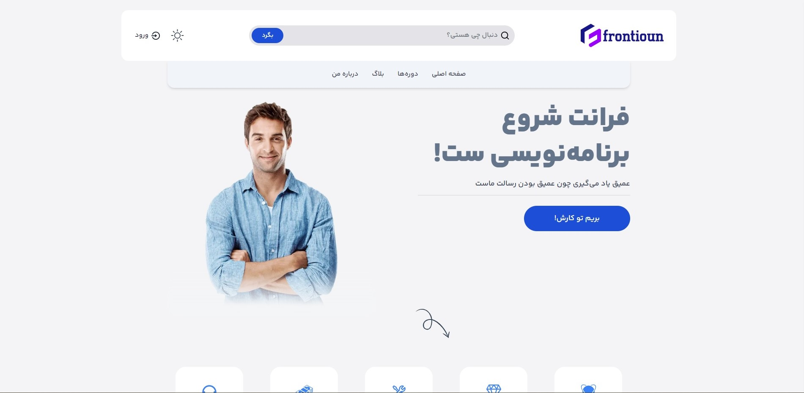

# Frontioun - Looking for better ways to learn

This is a my startup project [Frontioun](https://google.com). Frontioun help you improve your coding skills by building realistic projects.

## Table of contents

- [Overview](#overview)
  - [The challenge](#the-challenge)
  - [Screenshot](#screenshot)
  - [Links](#links)
- [My process](#my-process)
  - [Built with](#built-with)
  - [What I learned](#what-i-learned)
  - [Continued development](#continued-development)
  - [Useful resources](#useful-resources)
- [Author](#author)
- [Acknowledgments](#acknowledgments)

**Note: Delete this note and update the table of contents based on what sections you keep.**

## Overview

### The challenge

Users should be able to:

- View the optimal layout for the site depending on their device's screen size!
- Change the routing use Next-Link
- I would update this section if new features added!

### Screenshot



### Links

- Live Site URL: [Frontioun](https://your-live-site-url.com)

## My process

### Built with

- Semantic HTML5 markup
- CSS custom properties
- Flexbox
- CSS Grid
- Mobile-first workflow
- [TailwindCss](https://tailwindcss.com/) - For styles
- [React](https://reactjs.org/) - JS library
- [Next.js](https://nextjs.org/) - React framework

### What I learned

I proudly learned:
- How to write implement darkmode with Next-Theme and fix its ssr problems
- New expreiences with Next 13
- New expreiences with SSR

```css
@layer utilities {
  .logo__gradient {
    background: linear-gradient(270deg, #4ade80, #67e8f9, #f87171, #edf514);
    background-clip: text;
    color: transparent;
    background-size: 800%;
    animation: logo_animation 20s ease infinite;
  }

  @keyframes logo_animation {
    0% {
      background-position: 0% 50%;
    }
    50% {
      background-position: 100% 50%;
    }
    100% {
      background-position: 0% 50%;
    }
  }
}
```

```tsx
export default function App({ Component, pageProps }: any) {
  const renderWithLayout =
    Component.getLayout ||
    function (page: any) {
      return (
        <ThemeProvider defaultTheme="system" attribute="class">
          <Layout>{page}</Layout>
        </ThemeProvider>
      );
    };

  return renderWithLayout(<Component {...pageProps} />);
}

interface Props {
  children: ReactNode;
}

const NoSSR = (props: Props) => (
  <React.Fragment>{props.children}</React.Fragment>
);

export default dynamic(() => Promise.resolve(NoSSR), {
  ssr: false,
});
```

<!-- ### Continued development

Use this section to outline areas that you want to continue focusing on in future projects. These could be concepts you're still not completely comfortable with or techniques you found useful that you want to refine and perfect. -->

### Useful resources

- [Nextjs Docs](https://nextjs.org/) - This helped me for many reasons. I really liked this pattern and will use it going forward.
- [Tailwindcss Docs](https://tailwindcss.com/) - This is an amazing article which helped me finally line-clamp inside it's. I'd recommend it to anyone still learning this concept.

## Author

<!-- - Website - [Add your name here](https://www.your-site.com) -->
<!-- - Frontend Mentor - [@yourusername](https://www.frontendmentor.io/profile/yourusername) -->
- github - [@mohammadreza0110](https://github.com/mohammadreza0110)


<!-- ## Acknowledgments

This is where you can give a hat tip to anyone who helped you out on this project. Perhaps you worked in a team or got some inspiration from someone else's solution. This is the perfect place to give them some credit.

**Note: Delete this note and edit this section's content as necessary. If you completed this challenge by yourself, feel free to delete this section entirely.** -->
